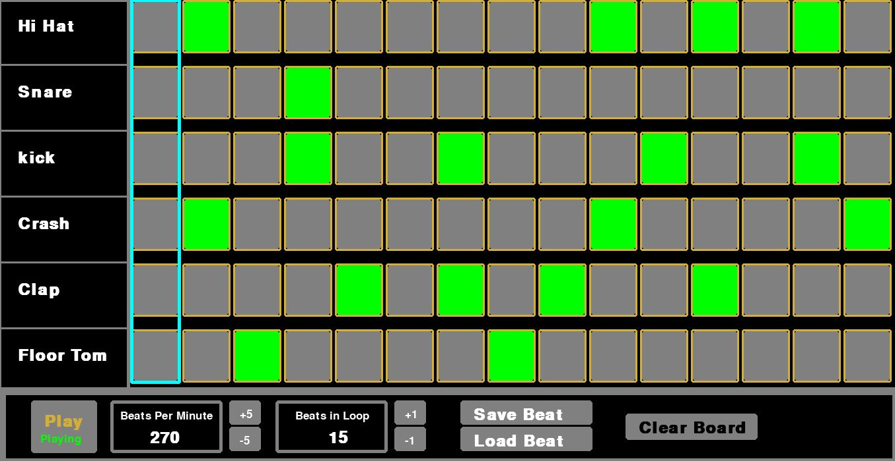

# Drum-ru 😎

Develop your own beats!
A virtual drum developed using Python - Pygame framework.

Custimizable beats with different sounds and colors.

#Installation

 - Download the Appliction from [here](https://github.com/awes0m/pybeats/raw/main/Drum_ru__Python_Based_drumPad_Windowsx86x64.zip)
 - Extract the Zip file in your preffered folder
 - The 'assets' folder and  'drum_ru.exe' and 'saved_beats' should be in the same folder

RUN drum_ru.exe to launch the application.

